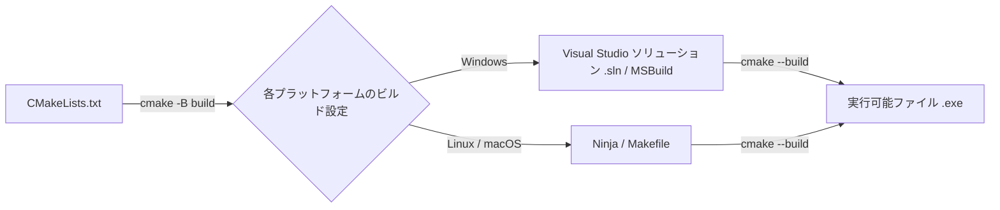

# Modern CMake 完全マスターガイド (For Rust / C# / Go / Java Developers)

C/C++ の世界でデファクトスタンダードとして使われているビルドシステムジェネレーター **CMake (Modern CMake)** の仕組み、書き方、作法をまとめた実践解説です。

---

## 🧭 1. CMake とは？ (ビルドツールの位置づけ)

CMake は「コンパイラ」でも「ビルドツール（直接ビルドするもの）」でもなく、**「ビルド設定ファイルを生成するメタビルドシステム（Build System Generator）」** です。



### 他言語との対比

| 言語 | ビルド定義ファイル | ビルドコマンド | 依存管理・ワークスペース |
| :--- | :--- | :--- | :--- |
| **C / C++** | `CMakeLists.txt` | `cmake -B build && cmake --build build` | CMake (`FetchContent`, `vcpkg`, `conan`) |
| **Rust** | `Cargo.toml` | `cargo build` | Cargo ワークスペース (`[workspace]`) |
| **C# (.NET)** | `.csproj` / `.sln` | `dotnet build` | NuGet (`<PackageReference>`) |
| **Go** | `go.mod` | `go build` | Go Modules (`go.work`) |
| **Java** | `build.gradle.kts` / `pom.xml`| `gradle build` / `mvn package` | Gradle / Maven Central |

---

## 🏗️ 2. Modern CMake の核心思想:「ターゲットベース設計」

2010年以前の古い CMake (Legacy CMake) では、`include_directories()` や `link_libraries()` などのグローバル変数を設定していたため、プロジェクトが巨大化すると設定が汚染されてバグの原因になっていました。

現代の **Modern CMake (CMake 3.0+)** は、**ターゲット（実行可能ファイルやライブラリ）を中心としたオブジェクト指向的な設計** になっています。

### 主要な 4 大コマンド

| コマンド | 役割 | 他言語でのイメージ |
| :--- | :--- | :--- |
| `add_executable(app main.cpp)` | 実行可能ターゲット `app` を定義 | Rust `[[bin]]` / C# `OutputType=Exe` |
| `add_library(mylib STATIC ...)` | ライブラリターゲット `mylib` を定義 | Rust `[lib]` / C# `OutputType=Library` |
| `target_include_directories(...)` | ヘッダーの探索パスをターゲットに紐付け | C# `<Include>` / Java `sourceSets` |
| `target_link_libraries(app mylib)` | ライブラリや依存関係をターゲットに結合 | Rust `dependencies` / C# `<ProjectReference>` |

---

## 🔑 3. 超重要: `PRIVATE` / `PUBLIC` / `INTERFACE` の違い

ターゲットにプロパティ（インクルードパス、コンパイルフラグ、リンクライブラリ）を設定する際、必ずこの3つのアクセス指定子を指定します。

```text
[ライブラリ A] ───(依存)───> [アプリ B]
```

| 指定子 | 自ターゲット (A) で使うか？ | 依存先ターゲット (B) に伝播するか？ | 主な用途 |
| :--- | :---: | :---: | :--- |
| **`PRIVATE`** | **使う (Yes)** | **伝播しない (No)** | 内部実装 (`src/*.cpp`) だけで使うヘッダーやライブラリ |
| **`PUBLIC`** | **使う (Yes)** | **伝播する (Yes)** | 公開ヘッダー (`include/*.hpp`) の中で型として露出している依存先 |
| **`INTERFACE`** | **使わない (No)** | **伝播する (Yes)** | ヘッダーオンリーライブラリ（実装 .cpp がないもの） |

#### 例:
```cmake
# mylib の公開ヘッダー (include/) は、mylib 自身でも使い、mylib をリンクする側 (app) にも伝える -> PUBLIC
target_include_directories(mylib PUBLIC ${CMAKE_CURRENT_SOURCE_DIR}/include)

# mylib の内部実装 (src/) だけで使うヘッダーは他人に公開しない -> PRIVATE
target_include_directories(mylib PRIVATE ${CMAKE_CURRENT_SOURCE_DIR}/src)
```

---

## 📝 4. 今回のサンプルにおける CMakeLists.txt の解説

### ① ルート `CMakeLists.txt`
```cmake
# 最低要求バージョン (3.20+ を指定)
cmake_minimum_required(VERSION 3.20)

# プロジェクト名と言語を宣言 (C と CXX(C++))
project(Modern_C_Cpp_Course LANGUAGES C CXX)

# コンパイラ別の共通オプション
if(MSVC)
    add_compile_options(/utf-8 /W4) # 文字化け防止 + 厳格な警告
else()
    add_compile_options(-Wall -Wextra -pedantic)
endif()

# サブプロジェクト (ディレクトリ) の追加
add_subdirectory(c_sample)
add_subdirectory(cpp_sample)
```

### ② `cpp_sample/CMakeLists.txt`
```cmake
cmake_minimum_required(VERSION 3.20)
project(cpp_sample LANGUAGES CXX)

# C++20 規格を強制
set(CMAKE_CXX_STANDARD 20)
set(CMAKE_CXX_STANDARD_REQUIRED ON)
set(CMAKE_CXX_EXTENSIONS OFF) # コンパイラ独自拡張を無効化

# ソースファイルのリスト
set(CPP_SOURCES
    src/main.cpp
    src/raii_and_smart_pointers.cpp
    src/move_semantics_and_classes.cpp
    src/stl_and_ranges.cpp
    src/templates_and_modern_types.cpp
    src/concurrency.cpp
)

# 実行ファイルターゲット作成
add_executable(cpp_sample ${CPP_SOURCES})

# MSVC用の例外モデル有効化
if(MSVC)
    target_compile_options(cpp_sample PRIVATE /EHsc)
endif()

# include/ ディレクトリを探索パスに追加
target_include_directories(cpp_sample PRIVATE
    ${CMAKE_CURRENT_SOURCE_DIR}/include
)

# 出力先を build/bin に集約
set_target_properties(cpp_sample PROPERTIES
    RUNTIME_OUTPUT_DIRECTORY "${CMAKE_BINARY_DIR}/bin"
)
```

---

## 📦 5. 外部ライブラリを導入する 2 つの現代的アプローチ

### 方法 A: `FetchContent` (最も手軽・Gitリポジトリを直接取得)
Rustの `Cargo.toml` のように、ビルド時に自動でGitHub等からライブラリをクローンしてビルドに組み込みます。

```cmake
include(FetchContent)

# 例: nlohmann/json (JSONライブラリ) を自動ダウンロード
FetchContent_Declare(
    json
    GIT_REPOSITORY https://github.com/nlohmann/json.git
    GIT_TAG        v3.11.3
)
FetchContent_MakeAvailable(json)

# 自ターゲットにリンクするだけ！
target_link_libraries(cpp_sample PRIVATE nlohmann_json::nlohmann_json)
```

### 方法 B: `find_package` (システムまたはパッケージマネージャから探索)
C++用のパッケージマネージャ（**vcpkg** や **Conan**）でインストールしたライブラリを検索してリンクします。

```cmake
find_package(fmt REQUIRED) # fmt ライブラリを検索
target_link_libraries(cpp_sample PRIVATE fmt::fmt)
```

---

## ⚡ 6. 覚えておくべき CMake 実行コマンド

```powershell
# 1. 構成 (Configure): ソースツリー (.) から ビルドツリー (build/) を生成
cmake -B build -S .

# 2. ビルド (Build): 指定した構成 (Release / Debug) でコンパイル
cmake --build build --config Release

# 特定のターゲットだけをビルドしたい場合:
cmake --build build --config Release --target cpp_sample

# 3. クリーンビルドしたい場合:
cmake --build build --target clean
# または build フォルダごと削除して再構成
Remove-Item -Recurse -Force build
```

---

## 🛠️ 7. VS Code での CMake 完全設定ガイド

VS Code で C/C++ と CMake を使って快適に「補完（IntelliSense）」「ビルド」「F5 デバッグ」を行うための完全マニュアルです。

### 7.1 必須・推奨の VS Code 拡張機能

VS Code の拡張機能タブ (`Ctrl + Shift + X`) から以下をインストールします。

1. **`C/C++`** (`ms-vscode.cpptools` / Microsoft公式)
   * C/C++ の構文ハイライト、コード補完、定義ジャンプ、デバッガー機能を提供。
2. **`CMake Tools`** (`ms-vscode.cmake-tools` / Microsoft公式)
   * VS Code 下部のステータスバーにビルド・デバッグボタンを追加し、CMakeLists.txt と IntelliSense を自動連携。
3. **`CMake`** (`twxs.cmake`)
   * `CMakeLists.txt` の構文ハイライトとコマンド入力補完。

---

### 7.2 CMake Tools の GUI 操作（基本フロー）

拡張機能 `CMake Tools` を入れると、VS Code 最下部の**ステータスバー**に CMake 専用の操作パネルが現れます。

```text
[CMake: [Visual Studio Community 2022 Release - amd64]: Ready] [Debug] [Build] [▶] [🐞] [Target: cpp_sample]
```

#### ① コンパイラ（Kit）の選択
* 初回起動時、またはステータスバーの `[CMake: ...]` をクリック（または `Ctrl + Shift + P` → `CMake: Select a Kit`）。
* Windows で Visual Studio を入れている場合は **`Visual Studio Community 2022 Release - amd64` (MSVC)** を選択。

#### ② ビルドバリアントの選択
* ステータスバーの `[Debug]` または `[Release]` をクリック（または `CMake: Select Variant`）。
  * **Debug**: 最適化なし・デバッグシンボル付き（ブレークポイントでの変数調査が正確）。
  * **Release**: 最大限の最適化・実行速度優先。

#### ③ ビルド & デバッグ実行
* **ビルド**: ステータスバーの **`[Build]`** または **`F7`** キー。
* **デバッグなし実行**: ステータスバーの **`[▶]`** または **`Shift + F5`**。
* **デバッグ起動**: ステータスバーの **`[🐞]`** または **`Ctrl + F5`**。

---

### 7.3 `.vscode` 設定ファイルによる高度な自動化

手動でコマンドを打たず、**「`F5` キーを一発押すだけで自動ビルドしてデバッガーを起動する」** ための `.vscode` 設定構成です。

#### 1. `.vscode/settings.json` (ワークスペース共通設定)
CMake Tools の挙動と IntelliSense の設定を行います。

```json
{
    // CMakeLists.txt の探索ルートディレクトリ
    "cmake.sourceDirectory": "${workspaceFolder}",

    // ビルドファイルの生成先
    "cmake.buildDirectory": "${workspaceFolder}/build",

    // 使用するジェネレータの固定 (MSVC 2022)
    "cmake.generator": "Visual Studio 17 2022",

    // CMakeLists.txt からインクルードパスを自動抽出して IntelliSense (赤波線) を解決
    "C_Cpp.default.configurationProvider": "ms-vscode.cmake-tools"
}
```

#### 2. `.vscode/tasks.json` (ビルドタスクの定義)
`F5` の前に自動実行されるビルドコマンドを登録します。

```json
{
    "version": "2.0.0",
    "tasks": [
        {
            "label": "CMake: Build (Release)",
            "type": "shell",
            "command": "cmake -B build -S . && cmake --build build --config Release",
            "group": {
                "kind": "build",
                "isDefault": true
            },
            "problemMatcher": "$msCompile"
        },
        {
            "label": "CMake: Build (Debug)",
            "type": "shell",
            "command": "cmake -B build -S . && cmake --build build --config Debug",
            "group": "build",
            "problemMatcher": "$msCompile"
        }
    ]
}
```

#### 3. `.vscode/launch.json` (デバッグ起動構成)
`F5` を押したときの挙動を定義します。

```json
{
    "version": "0.2.0",
    "configurations": [
        {
            "name": "▶ Run/Debug: Modern C++ Sample (Release)",
            // Windows MSVC の場合は "cppvsdbg" を指定 (MinGW/GCC の場合は "cppdbg")
            "type": "cppvsdbg",
            "request": "launch",
            // ビルドされた実行ファイルのパス
            "program": "${workspaceFolder}/build/bin/Release/cpp_sample.exe",
            "args": [],
            "stopAtEntry": false,
            "cwd": "${workspaceFolder}",
            "environment": [],
            "console": "integratedTerminal",
            // 起動前に tasks.json のビルドタスクを自動実行
            "preLaunchTask": "CMake: Build (Release)"
        }
    ]
}
```

---

### 7.4 ワークスペース構成別のポイント

VS Code で開くフォルダ階層によって設定を柔軟に切り替えることができます。

* **パターン A: ルート `C++` を開いている場合**
  * `C++/.vscode/launch.json` に `c_sample` と `cpp_sample` の両方の起動構成を登録。
  * 「実行とデバッグ」タブ（`Ctrl + Shift + D`）のドロップダウンから動かしたい方を選択して `F5`。
* **パターン B: `cpp_sample` 単体フォルダを開いている場合**
  * `cpp_sample/.vscode/` 配下に設定があるため、何も設定を変更することなく即座に `F5` で起動可能。

---

### 7.5 よくあるトラブルと解決策

#### ⚠️ エラー: `"cmakeDebugType" が "script" に設定されている...`
* **原因**: `launch.json` のデバッグタイプに `"type": "cmake"` を指定している。
  * `"type": "cmake"` は CMake の `.cmake` スクリプト自体をデバッグする特殊な用途のものです。
* **解決策**: C/C++ プログラムのデバッグには **`"type": "cppvsdbg"` (MSVC)** または **`"type": "cppdbg"` (GDB/LLDB)** を指定してください。

#### ⚠️ エラー: `#include` に赤波線が出る (IntelliSense エラー)
* **原因**: VS Code がヘッダーファイルの探索パスを認識できていない。
* **解決策**:
  1. `Ctrl + Shift + P` → `CMake: Configure` を実行。
  2. `.vscode/settings.json` に `"C_Cpp.default.configurationProvider": "ms-vscode.cmake-tools"` が記載されていることを確認。

#### ⚠️ 警告: `C4819: ファイルは、現在のコード ページ (932) で表示できない文字を含んでいます`
* **原因**: MSVC がソースコードをデフォルトの Shift_JIS (CP932) として解釈し、日本語コメント等で文字化け・構文エラーを起こしている。
* **解決策**: `CMakeLists.txt` に以下を追加して UTF-8 で解釈させます。
  ```cmake
  if(MSVC)
      target_compile_options(ターゲット名 PRIVATE /utf-8)
  endif()
  ```

